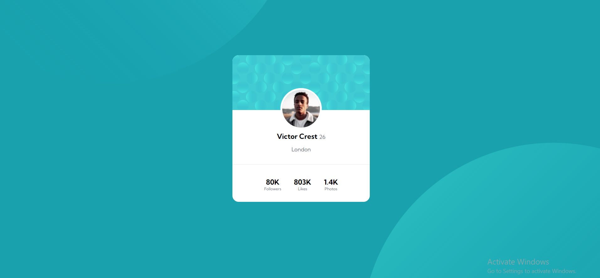

## Table of contents

- [Overview](#overview)
  - [The challenge](#the-challenge)
  - [Screenshot](#screenshot)
  - [Links](#links)
- [My process](#my-process)
  - [Built with](#built-with)
  - [What I learned](#what-i-learned)
  - [Continued development](#continued-development)
- [Author](#author)

## Overview

### The challenge

- Build out the project to the designs provided

### Screenshot

### Links

- Solution URL: [GitHub](https://github.com/gabadadzeluca/profile-card-component-main)
- Live Site URL: [Live Page](https://your-live-site-url.com)

## My process

### Built with

- Semantic HTML5 markup
- CSS custom properties
- Flexbox
- Mobile-first workflow

### What I learned

I learned that it's neccessary to use Mobile-first aproach. Used flex in css multiple times, and added background-image with url.

### Continued development

Adding image that's not connected to a column or a row was a challange. I used position:absolute for the solution, but there must be better ways to style the image.

## Author

- Website - [GitHub](https://github.com/gabadadzeluca)

